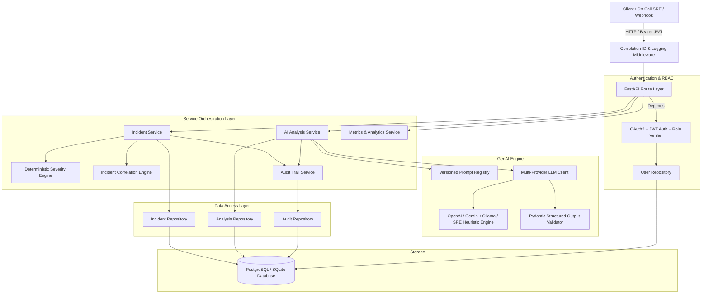
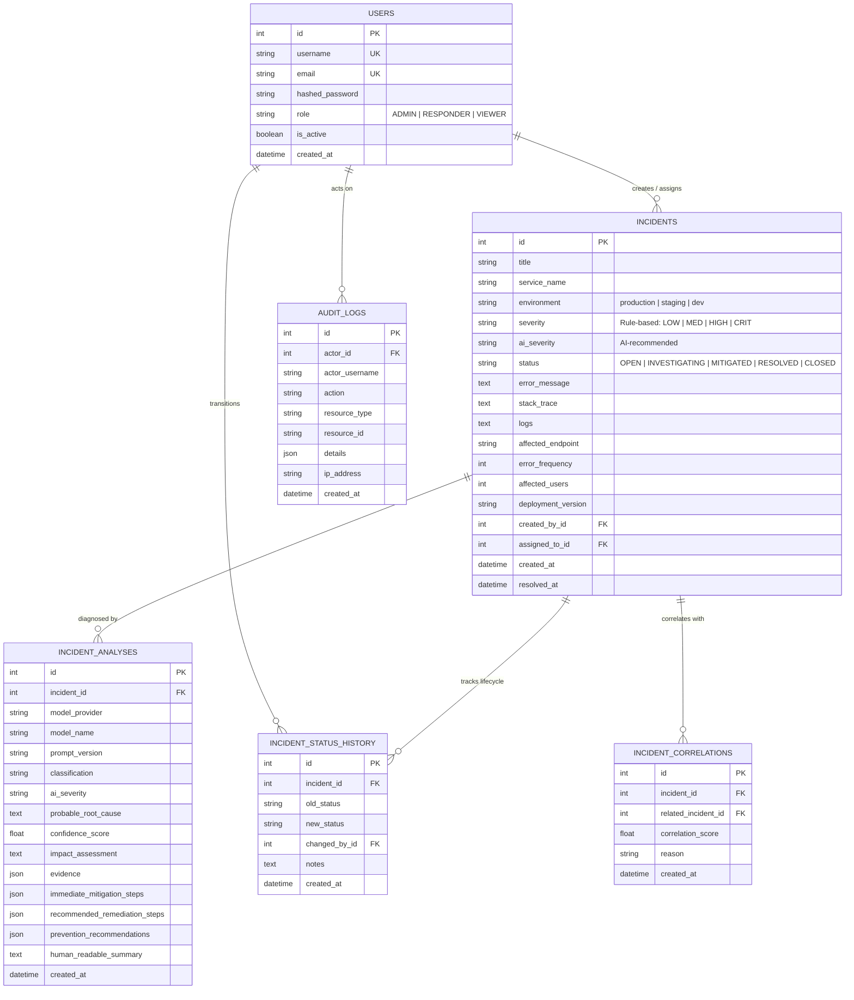
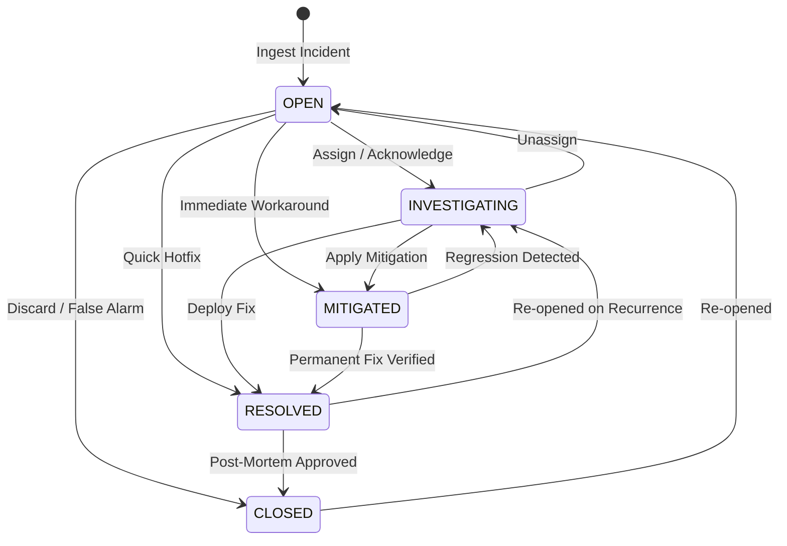

# AI-Powered Incident Response & Root Cause Analysis Platform

[](https://fastapi.tiangolo.com)
[](https://www.python.org/)
[](https://www.postgresql.org/)
[](https://www.sqlalchemy.org/)
[](https://www.docker.com/)
[](LICENSE)

An enterprise-grade, production-style backend platform designed to automate site reliability engineering (SRE) workflows: deterministic incident triage, cascade correlation, and **strictly-validated GenAI Root Cause Analysis (RCA)**.

---

## 🎯 What Sets This Apart From a Simple "Chatbot"?

Unlike basic wrapper chatbots or raw prompt interfaces:
1. **Layered Domain Architecture**: Pure separation of concerns (`API Route` $\to$ `Service` $\to$ `Repository` $\to$ `Database`).
2. **Dual Severity Engines**: Compares **rule-based deterministic severity** (evaluating user blast radius, error velocity, infrastructure criticality) against **GenAI diagnostic severity**.
3. **Pydantic Structured JSON Validation**: The LLM outputs strict JSON strictly validated against SRE diagnostic contracts. Never returns uncontrolled raw chat markdown.
4. **Epistemic Humility & Evidence Grounding**: The AI prompt and validator require strict distinction between **observed facts**, **inferred causes**, and **uncertain hypotheses**, attaching an empirical confidence score ($0.0 \to 1.0$).
5. **Deterministic Incident Correlation**: Automatically detects cascading failures and related incidents across services, endpoints, and deployment versions.
6. **Finite State Machine Lifecycle**: Enforces strict operational transitions (`OPEN` $\to$ `INVESTIGATING` $\to$ `MITIGATED` $\to$ `RESOLVED` $\to$ `CLOSED`) with full historical audit trails.
7. **Zero-Setup Offline Fallback**: Features a high-fidelity Heuristic SRE Engine guaranteeing 100% test pass rates and instant demoability without external paid API keys.

---

## 🏗️ System Architecture



---

## 🗄️ Database Entity-Relationship (ER) Schema



---

## 🔄 Incident Lifecycle State Machine



---

## 🛠️ Technology Stack

| Component | Technology | Rationale |
|---|---|---|
| **Language** | Python 3.11+ | Type hints, async support, rich data ecosystem |
| **API Framework** | FastAPI + Uvicorn | High-performance ASGI framework with automatic OpenAPI docs |
| **ORM & DB** | SQLAlchemy 2.0 + PostgreSQL / SQLite | Strict typed queries, connection pooling, Alembic migrations |
| **Data Validation** | Pydantic v2 | High-performance JSON schema serialization and strict validation |
| **AI Integration** | OpenAI / Gemini / Ollama / SRE Engine | Multi-provider architecture with structured JSON output enforcement |
| **Security & Auth** | JWT + bcrypt + OAuth2 | Role-Based Access Control (`ADMIN`, `RESPONDER`, `VIEWER`) |
| **Testing** | Pytest + FastAPI TestClient | 100% automated coverage across auth, lifecycle, severity, AI, and audit |
| **Infrastructure** | Docker + Docker Compose | Containerized reproducible execution |

---

## 🚀 Quickstart & Local Setup

### 1. Clone & Setup Virtual Environment
```bash
git clone https://github.com/your-username/ai-incident-response-platform.git
cd ai-incident-response-platform/backend

# Create and activate virtual environment
python -m venv venv
# On Linux/macOS:
source venv/bin/activate
# On Windows:
.\venv\Scripts\activate

# Install dependencies
pip install -r requirements.txt
```

### 2. Configure Environment Variables
```bash
cp .env.example .env
```
*(By default, `.env` runs in zero-setup mode using SQLite and the built-in SRE Heuristic Engine. If you wish to use OpenAI or Gemini, set `AI_PROVIDER=openai` or `AI_PROVIDER=gemini` along with your API key).*

### 3. Seed Demo Data
```bash
python -m app.scripts.seed_demo_data
```

### 4. Start the Application
```bash
uvicorn app.main:app --reload --port 8000
```
Open **Interactive Swagger UI**: [http://localhost:8000/docs](http://localhost:8000/docs)

Default Demo Accounts:
| Role | Username | Password |
|---|---|---|
| **ADMIN** | `admin` | `Password123!` |
| **RESPONDER** | `responder_sarah` | `Password123!` |
| **VIEWER** | `viewer_bob` | `Password123!` |

---

## 🐳 Docker Compose Quickstart

Run PostgreSQL and FastAPI together in containers:

```bash
docker-compose up --build -d
```
The API and Swagger docs will be live at `http://localhost:8000/docs`.

---

## 🧪 Running Automated Tests

Run the full integration and unit test suite:

```bash
cd backend
pytest -v
```

Test coverage includes:
- ✅ User registration & first-user Admin bootstrapping
- ✅ JWT Authentication & OAuth2 password flow
- ✅ Role-Based Access Control (RBAC) enforcement
- ✅ Incident creation with deterministic rule severity calculation
- ✅ State machine lifecycle transition validation
- ✅ Multi-signal incident correlation matching
- ✅ Structured LLM parser with markdown cleaning and Pydantic validation
- ✅ AI service fallback and error recovery
- ✅ Immutable audit trail verification
- ✅ Dashboard metrics and MTTR calculations

---

## 📖 API Reference Summary

### Authentication & Users
| Method | Endpoint | Description | Allowed Roles |
|---|---|---|---|
| `POST` | `/api/v1/auth/register` | Register new user account | Public |
| `POST` | `/api/v1/auth/login` | Authenticate & get JWT | Public |
| `GET` | `/api/v1/auth/me` | Fetch active user profile | All authenticated |
| `GET` | `/api/v1/users` | List all users | `ADMIN` |
| `PATCH` | `/api/v1/users/{user_id}/role` | Update user role | `ADMIN` |

### Incidents & Lifecycle
| Method | Endpoint | Description | Allowed Roles |
|---|---|---|---|
| `POST` | `/api/v1/incidents` | Ingest new incident (with auto-severity & correlation) | `ADMIN`, `RESPONDER` |
| `GET` | `/api/v1/incidents` | Filtered & paginated incident listing | `ADMIN`, `RESPONDER`, `VIEWER` |
| `GET` | `/api/v1/incidents/{id}` | Retrieve incident details | `ADMIN`, `RESPONDER`, `VIEWER` |
| `PATCH` | `/api/v1/incidents/{id}` | Update incident attributes | `ADMIN`, `RESPONDER` |
| `DELETE` | `/api/v1/incidents/{id}` | Delete incident | `ADMIN` |
| `POST` | `/api/v1/incidents/{id}/assign` | Assign responder (auto moves to `INVESTIGATING`) | `ADMIN`, `RESPONDER` |
| `POST` | `/api/v1/incidents/{id}/status` | Transition lifecycle state with validation | `ADMIN`, `RESPONDER` |
| `POST` | `/api/v1/incidents/{id}/resolve` | Fast resolve endpoint | `ADMIN`, `RESPONDER` |
| `GET` | `/api/v1/incidents/{id}/correlations` | Get correlated/cascade incidents | `ADMIN`, `RESPONDER`, `VIEWER` |
| `GET` | `/api/v1/incidents/{id}/status-history` | Audit log of state transitions | `ADMIN`, `RESPONDER`, `VIEWER` |
| `GET` | `/api/v1/incidents/{id}/audit` | Immutable audit trail for incident | `ADMIN`, `RESPONDER`, `VIEWER` |

### GenAI Analysis & Metrics
| Method | Endpoint | Description | Allowed Roles |
|---|---|---|---|
| `POST` | `/api/v1/incidents/{id}/analyze` | Trigger structured AI Root Cause Analysis | `ADMIN`, `RESPONDER` |
| `GET` | `/api/v1/incidents/{id}/analyses` | Fetch historical AI analyses for incident | `ADMIN`, `RESPONDER`, `VIEWER` |
| `GET` | `/api/v1/analyses/{analysis_id}` | Fetch specific AI diagnosis record | `ADMIN`, `RESPONDER`, `VIEWER` |
| `GET` | `/api/v1/incidents/stats` | Dashboard statistics & MTTR metrics | `ADMIN`, `RESPONDER`, `VIEWER` |
| `GET` | `/api/v1/health` | Health & liveness probe | Public |
| `GET` | `/api/v1/health/db` | Database connectivity check | Public |
| `GET` | `/api/v1/health/ai` | AI provider readiness & model check | Public |

---

## 📋 Example End-to-End Workflow

### 1. Ingest an Incident
```bash
curl -X POST http://localhost:8000/api/v1/incidents \
  -H "Authorization: Bearer <TOKEN>" \
  -H "Content-Type: application/json" \
  -d '{
    "title": "Payment Gateway Connection Pool Exhaustion",
    "service_name": "payment-gateway",
    "environment": "production",
    "error_message": "sqlalchemy.exc.TimeoutError: QueuePool limit of size 20 reached",
    "error_frequency": 600,
    "affected_users": 1800,
    "affected_endpoint": "/api/v1/payments/charge"
  }'
```

### 2. Trigger AI Root Cause Analysis (RCA)
```bash
curl -X POST http://localhost:8000/api/v1/incidents/1/analyze \
  -H "Authorization: Bearer <TOKEN>" \
  -H "Content-Type: application/json" \
  -d '{"run_async": false}'
```

**Structured JSON Response Example:**
```json
{
  "id": 1,
  "incident_id": 1,
  "model_provider": "heuristic-sre-engine",
  "model_name": "sre-expert-rule-v1",
  "prompt_version": "incident_analysis_v1",
  "classification": "Database Connection Exhaustion",
  "ai_severity": "CRITICAL",
  "probable_root_cause": "The connection pool for 'payment-gateway' reached max capacity. Active database transactions are either stalling on unindexed lock contention or leaking connections without closing in finally blocks.",
  "confidence_score": 0.94,
  "impact_assessment": "High latency and 500 errors on /api/v1/payments/charge. Blocking 1800 concurrent user sessions.",
  "evidence": [
    "Error signature: 'sqlalchemy.exc.TimeoutError: QueuePool limit of size 20 reached'",
    "Service affected: payment-gateway in production",
    "Traffic velocity: 600 errors/min recorded on /api/v1/payments/charge"
  ],
  "immediate_mitigation_steps": [
    "Temporarily increase max_connections / pool_size limit by 50% via configuration override.",
    "Execute 'SELECT * FROM pg_stat_activity WHERE state != 'idle'' to terminate runaway long-running transactions.",
    "Restart hung worker instances to immediately release orphaned sockets."
  ],
  "recommended_remediation_steps": [
    "Audit ORM session lifecycle to guarantee 'session.close()' inside contextual blocks.",
    "Add database connection pool monitoring and Prometheus alerts for pool saturation > 80%.",
    "Introduce PgBouncer or proxy connection pooler to multiplex client connections."
  ],
  "prevention_recommendations": [
    "Set strict database query timeout (e.g. statement_timeout = 3000ms).",
    "Add stress/chaos testing in staging simulating 3x peak connection concurrency."
  ],
  "human_readable_summary": "Critical connection pool exhaustion in payment-gateway causing 500 error cascade on /api/v1/payments/charge. Mitigation requires killing idle queries and scaling pool capacity, followed by connection leak code fix.",
  "created_at": "2026-08-16T12:00:00Z"
}
```

---

## 🔮 Future Improvements

1. **Vector Embedding Incident Correlation**: Plug in pgvector / OpenAI text-embedding-3-small to enable dense vector similarity search on historical incident post-mortems.
2. **Automated Runbook Webhooks**: Integrate Slack / PagerDuty / Opsgenie dispatchers for instant incident commander paging.
3. **Agentic Remediation Execution**: Safe sandbox execution of AI-recommended mitigation commands with human-in-the-loop approval.

---

## 📄 License
This project is licensed under the MIT License.
